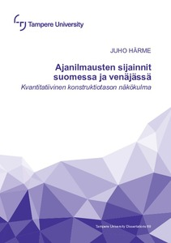

--- 

```{r, echo=FALSE, fig.width=4}
load("L2data.rda")
langlist<- c('fi', 'ru')

L2_S1_collocates <- list()
for (lang in langlist){
    L2_S1_collocates[[lang]] <- list()
    for(subgroup in c("a","b")){
        for(naprl in c("left","right")){
            colname  <- paste0("colloc.", naprl,"1")
            tabs <- as.data.frame(sort(table(subset(L2data[[lang]][[subgroup]]$S1,rep=="no")[,colname]),d=T))
            tabs$percent <- round(tabs[,2]/sum(tabs[,2])*100,2)
            L2_S1_collocates[[lang]][[subgroup]][[naprl]] <- tabs
        }
    }
}


difplot <- d %>% 
  mutate(location3=case_when(location3=='S1' ~ 'alku', location3=='S4' ~'loppu', T ~ 'keski')) %>%
  count(lang,location3) %>% 
  group_by(lang) %>% 
  mutate(freq=100*(n/sum(n))) %>% 
  ggplot(aes(x=location3,y=freq,fill=lang)) +
      geom_bar(stat="identity", position=position_dodge(width=0.4), width=0.5) + 
      #geom_label(aes(label=paste0("n=",n)),color="white", position = position_dodge(width = 1)) + 
      ylab("osuus / prosenttia")   +  guides(fill=FALSE) + theme(legend.position="none")  +xlab("sijainti")
```


## Lyhyt sisällys 

>- Tutkimuksen aihe ja sijoittuminen <!-- MUISTA cx! -->
>- Aineisto ja lähestymistapa
>- Poimintoja tuloksista
>- Konkreettisia esimerkkejä

---


<div class='glossme'>
<p>Я вчера поймал во-о-от такую щуку!</p>
<p>minä eilen napata-PRET - tälainen hauki-ACC</p>
<p></p>
</div>

Huhtikuusta 1999 SaiPan päävalmentajana toiminut Mansikka, 41, valmensi aikaisemmin seuran A-juniorijoukkuetta kolme vuotta.

## Tutkimusaineistosta

<iframe src="content/impressjs/impressjs_template.html"></iframe>


##  Yleistason tuloksia

>- alkusijainti, keskisijainti, loppusijainti
>- oletussijainti
>- lauseen alku vs. loppu
>- tilastollinen malli: ilmauskohtaiset erot + epäsuora evidenssi

---

```{r, echo=FALSE}
difplot + geom_label(aes(label=paste0("n=",n)),color="white", position = position_dodge(width = 1))  + facet_grid(~lang) 
```


---

<article class="columncontainer">


<div>

```{r, echo=FALSE, fig.width=4}
difplot
```

</div>

<div>
>- morfologinen rakenne 
>- semanttinen funktio (11 kpl)
>- positionaalisuus
>- numeraalin läsnäolo
</div>

</article>

# Esimerkki: Johdantokonstruktio


---

<article class="columncontainer">


<div>

```{r, echo=FALSE, fig.width=4}
difplot
```

</div>

<div class="build">
- Positionaaliset ilmaukset
- Deiktiset päivännimet (erit. eilen)
- simultaaninen funktio
</div>

</article>


---

<div class='glossme'>
<p>В среду Госдума на очередном пленарном заседании рассмотрит ситуацию в Ливии.</p>
<p>PREP keskiviikko-PREP duuma PREP seuraava-PREP täysi-PREP istunto-PREP käsitellä-FUT-p3 tilanne-ACC PREP Libya-PREP</p>
<p>\'[Keskiviikkona] duuma [täysi-istunnossaan] käsittelee Libyan tilannetta.\'</p>
</div>

https://newdaynews.ru/moskow/325004.html

## Viikonpäivien vasempia kollokaatteja

```{r, echo=FALSE}
tabs <- lapply(list(L2_S1_collocates$fi$a$left[1:10,], L2_S1_collocates$ru$a$left[1:10,]), 
               function(x) x %>% mutate(percent=paste0(percent, " %")))
PrintCompTable(tabs, 
               c("Kollokaatti","Frek.","Suht. frek."), 
               c("Suomi"=3,"Venäjä"=3),
               "")

```

---

<div class='glossme'>
<p>Вчера вторая ракетка Открытого чемпионата Франции Мария Шарапова провела свой первый матч на парижских грунтовых кортах.</p>
<p>eilen toinen tennispelaaja avoin-GEN mestaruuskilpailu-GEN Ranska-GEN Marija Šarapova suorittaa-PRET POSS ensimmäinen-ACC ottelu-ACC PREP pariisilaiset-PREP massa-PREP kentät-PREP</p>
<p>'[eilen] Ranskan avoimen tennisturnauksen toiseksi sijoitettu pelaaja Marija Šarapova pelasi ensimmäisen ottelunsa Pariisin massakentillä.'</p>
</div>

---


---

<article class="columncontainer build smaller">

<section class="depvar">

### Sijainti ($y$)

- alku
- keski
- loppu

</section>


<section class="arrow_box">

### Selittävät muuttujat ($x$)

>- Lähdekorpuksen tyyppi 
>- subjektin pituus 
>- Uuden esittelyyn viittaava verbi?
>- Eilen vs. viime viikolla vs. viime vuonna
>- Kieli 

</section>


</article>

# Muita esimerkkejä (lyhyesti)

---

> - Mansikka, 41, valmensi aikaisemmin seuran A-juniorijoukkuetta kolme vuotta.
> - Yli kolme miljoonaa opiskelijaa on saanut Erasmus-apurahaa vuodesta 1987 lähtien. 
> - Oppositio sätti niin hallituksen talouslinjan kuin säästötkin budjettikeskustelussa eduskunnassa keskiviikkona. 

## Väitöskirja 

<article class="columncontainer">
<div></div>
<div>http://urn.fi/URN:ISBN:978-952-03-1106-3 (trepo.tuni.fi)</div>
</article>


